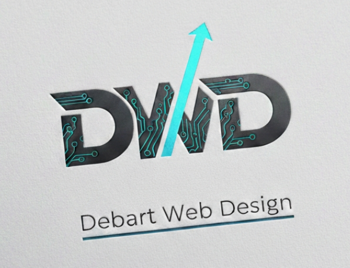

# Debart Web Design — Portfolio professionnel



## 🎨 Présentation

**Debart Web Design (DWD)** est le site professionnel de **Jonathan Debart**, développeur full‑stack bilingue (FR/EN), spécialisé dans la création de sites modernes, performants et élégants.

Basé entre **la France et les Philippines**, j’allie :
- une **expertise technique solide**,
- une **sensibilité artistique**,
- et un **rapport qualité/prix compétitif** grâce au travail à distance.

Ce site sert de vitrine à mon travail, à mon style, et à ma méthodologie.

---

## 🧰 Stack technique

Le projet utilise un stack simple, propre et efficace :

### **Front-end**
- HTML5  
- CSS3 / SASS  
- JavaScript (vanilla, modules)  

### **Back-end**
- PHP (templating léger, includes modulaires)

### **Outils**
- Node.js (compilation SASS)  
- Git / GitHub  
- XAMPP (environnement local)

---

## 📁 Structure du projet
Debart-Web-Design/
│
├── assets/
│   ├── css/
│   │   ├── style.scss
│   │   └── style.css
│   ├── js/
│   │   └── main.js
│   ├── img/
│   └── fonts/
│
├── components/
│   ├── header.php
│   ├── nav.php
│   └── footer.php
│
├── pages/
│   ├── about.php
│   ├── services.php
│   ├── portfolio.php
│   └── contact.php
│
├── index.php
└── .htaccess

---

## ✨ Fonctionnalités

- Design **sérieux + artistique** basé sur les couleurs du logo DWD  
- Navigation responsive avec **burger menu animé**  
- Sections : Hero, À propos, Services, Portfolio, Contact  
- Animations douces au scroll (IntersectionObserver)  
- Code organisé en **composants PHP réutilisables**  
- Architecture mobile-first  
- Style moderne avec **dégradés, ombres douces et accents néon**  
- Formulaire de contact (version front-end)

---

## 🚀 Installation (local)

1. Cloner le repo :
   ```bash
   git clone https://github.com/TritonDeLaVega/Debart-Web-Design.git

